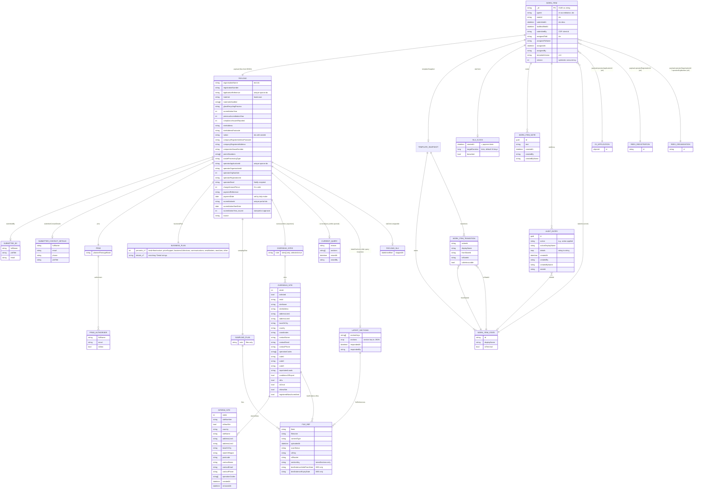

# Case Management (CM) — Re-accreditation schema & ERD

Source: `epr-register-enrol-management-be` @ `origin/main` (`ef6a005`, 2026-10-08).
Purpose: input to designing a ReEx → CM update API.

> **Scope note.** CM persistence lives only in `epr-register-enrol-management-be`. `epr-register-enrol-management-fe`
> and `epr-register-enrol-mgmt-tests` hold no schema (the FE calls the CM backend; the tests exercise it).

## 1. Key facts for API design

1. **Store:** MongoDB. The re-accreditation case is **one generic framework document in `workItems`** — a
   *work-item envelope* (typed columns) plus a **free-form `payload` BSON sub-document** whose shape is defined by the
   module (`re-accreditation`, template `v14`), not by a schema. There is no relational/ERD structure beyond that:
   assignment, notes, audit log, SLA clock and the template snapshot are all embedded in the same document.
2. **The payload is the contract, and it is only partly typed.** `ReAccreditationPayload` (C#) is just the module's
   *read model* (`[BsonIgnoreExtraElements]`); the operator backend writes many more keys at submission
   (see §4). Anything ReEx writes into `payload` that the module doesn't know is retained but ignored.
3. **State machine, not CRUD.** Status is `stateId`, changed only via transitions. Many transitions are
   `CallerInvocable: false` and reachable only through bespoke endpoints that carry side-effects (SLA clock,
   accreditation-number issuance, status push to OJ, notifications). **A ReEx API must go through these endpoints
   (or a new one), never write `stateId` directly** — otherwise SLA, audit, notifications and OJ status push diverge.
4. **Frozen template per item.** Each work item stores a `templateSnapshot` (states + transitions + `templateVersion`)
   captured at submission. Older items keep older action sets; the module ships snapshot migrations
   (`ReAccreditation*SnapshotMigration`) to patch them. New transitions don't reach existing items automatically.
5. **Identifiers:** `id` (GUID, string-typed in Mongo) is the work-item id and is what OJ stores as
   `caseManagementWorkItemId`. `payload.applicationReference` (`RA-#########`, server-generated, unique-sparse) is the
   human reference. `payload.operatorApplicationId` (= OJ `AccreditationApplicationModel.Id`, unique-sparse) is the
   idempotency key for submission retries — **not** `operatorRegistrationId` (the ReEx registration id).
   `payload.accreditationId` is the issued accreditation number (unique, partial-filter on string type).
6. **Concurrency:** `version` (int) optimistic token incremented on every `ReplaceAsync`; concurrent writers get
   `WorkItemConcurrencyException`.
7. **Nation routing:** `payload.nation` (string-valued enum; RA-551 — must stay a string or nation-scoped worklist
   filters `{payload.nation: {$in:[…]}}` stop matching) scopes which regulators see an item. RA-526: now supplied by
   the OJ from the registration's regulator; defaults to `England` if absent/unrecognised.
8. **SLA:** 12 weeks (84 days) from the regulator-entered **payment date** (not from "now"); at-risk when ≤14 days
   remain. Clock is stopped on approval, can be extended/overridden.

## 2. ERD

All `WORK_ITEM` children are embedded sub-documents/arrays (contained-in, not foreign keys).



## 2a. Document schema (`workItems`)

The ERD above as a single document. `?` = nullable/optional, `[]` = array, `"a|b"` = enum, `(srv)` = server-written,
`(OJ)` = written by the operator backend at submit. `payload` is schemaless: this is the shape the code reads and writes,
not an enforced schema, and every payload field should be treated as optional.

```jsonc
{
  "_id": "string (GUID)",
  "typeId": "re-accreditation",
  "stateId": "submitted|duly-made|assessment-in-progress|awaiting-decision|queried|updated|approved|rejected|withdrawn",
  "submittedAt": "datetime",
  "lastModifiedAt": "datetime",
  "submittedBy": "string? (CDP client id)",
  "assignedToId": "string?",
  "assignedToName": "string?",
  "assignedAt": "datetime?",
  "assignedBy": "string?",
  "templateVersion": "string? (v14)",
  "version": "int",                          // optimistic lock

  "slaClock": {                              // null until duly-make
    "startedAt": "datetime (= payment date)",
    "targetDuration": "long (ticks; default 84 days)",
    "breached": "bool"
  },

  "templateSnapshot": {                      // frozen at submission
    "templateVersion": "string",
    "states": [ { "_id": "string", "displayName": "string", "isTerminal": "bool" } ],
    "transitions": [
      { "actionId": "string", "displayName": "string", "fromStateId": "string", "toStateId": "string", "callerInvocable": "bool" }
    ]
  },

  "notes": [
    { "_id": "guid", "text": "string", "createdAt": "datetime", "createdBy": "string?", "createdByName": "string?" }
  ],

  "auditLog": [
    {
      "_id": "guid", "action": "string", "actionDisplayName": "string",
      "details": { "<key>": "string?" },
      "createdAt": "datetime", "createdBy": "string?", "createdByName": "string?", "stateId": "string?"
    }
  ],

  "payload": {
    "applicationReference": "string (srv, RA-#########, unique)",
    "source": "string (srv)",
    "organisationName": "string? (OJ)",
    "registrationNumber": "string? (OJ)",
    "materialsHandled": ["string"],           // (OJ) lowercase
    "material": "string? (OJ, lowercase)",
    "glassRecyclingProcess": "glass_re_melt|glass_other ?",
    "accreditationYear": "int? (OJ; re-stamped at approval)",
    "previousAccreditationYear": "int? (OJ)",
    "complianceIssuesReported": "int? (OJ)",
    "siteAddress": "string? (OJ)",
    "siteAddressPostcode": "string? (OJ)",
    "nation": "England|Scotland|Wales|NorthernIreland ?",   // stored as string
    "companyRegisterAddressPostcode": "string? (OJ)",
    "companyRegisteredAddress": "string? (OJ)",
    "companiesHouseNumber": "string? (OJ)",
    "permitNumbers": ["string"],
    "wasteProcessingType": "string? (OJ)",
    "operatorApplicationId": "string? (OJ, unique)",
    "operatorOrganisationId": "string? (OJ, ReEx ObjectId)",
    "operatorOrgNumber": "int? (OJ, ReEx numeric org no.)",
    "operatorRegistrationId": "string? (OJ, ReEx registration)",
    "operatorEmail": "string? (OJ, Notify recipient)",
    "chargeAmountPence": "int? (OJ; 0 is valid)",
    "paymentReference": "string? (OJ)",
    "paymentDate": "string? yyyy-MM-dd (srv, set at duly-make)",
    "accreditationId": "string? (srv, set at approval, unique)",
    "accreditationStartDate": "date? (srv)",
    "slaClock": { "stoppedAt": "datetimeoffset? (srv, set at approval)" },

    "submittedBy": { "fullName": "string", "jobTitle": "string", "email": "string?" },
    "submitterContactDetails": { "fullName": "string?", "email": "string?", "phone": "string?", "jobTitle": "string?" },

    "prns": {
      "plannedTonnageBand": "UpTo500|UpTo5000|UpTo10000|Over10000 ?",
      "authorisers": [ { "fullName": "string", "email": "string", "isNew": "bool" } ]
    },

    "businessPlan": {
      "newInfrastructurePercent": "int?", "priceSupportPercent": "int?", "businessCollectionsPercent": "int?",
      "communicationsPercent": "int?", "newMarketsPercent": "int?", "newUsesPercent": "int?", "otherPercent": "int?",
      "newInfrastructureDetail": "string?", "priceSupportDetail": "string?", "businessCollectionsDetail": "string?",
      "communicationsDetail": "string?", "newMarketsDetail": "string?", "newUsesDetail": "string?", "otherDetail": "string?"
    },

    "samplingPlan": {
      "files": [
        {
          "fileId": "string", "filename": "string", "contentType": "string", "uploadedAt": "datetime",
          "scanStatus": "string", "s3Key": "string", "s3Bucket": "string?"
        }
      ]
    },

    "overseasSites": {                        // exporters only; selected sites only
      "sites": [
        {
          "siteId": "int", "selected": "bool", "orsId": "string?", "siteName": "string", "siteAddress": "string?",
          "addressLine1": "string?", "addressLine2": "string?", "townOrCity": "string?", "country": "string?",
          "coordinates": "string?", "contactName": "string?", "contactEmail": "string?", "contactPhone": "string?",
          "operationCodes": ["string"], "code1": "string?", "code2": "string?", "code3": "string?",
          "repatriatedLoads": "string?", "conditionsOfExport": "bool?", "isEu": "bool", "isOecd": "bool",
          "isNewSite": "bool", "registeredNowAccredited": "bool",
          "interimSite": "InterimSite? (first active)",
          "interimSites": [
            {
              "siteId": "int", "siteNumber": "string", "isNewSite": "bool", "country": "string", "siteName": "string",
              "addressLine1": "string", "addressLine2": "string?", "townOrCity": "string",
              "stateOrRegion": "string?", "postcode": "string?",
              "contactName": "string", "contactEmail": "string", "contactPhone": "string",
              "operationCodes": ["string"], "createdAt": "datetime?", "removedAt": "datetime? (null = active)"
            }
          ],
          "besEvidence": {
            "files": [
              {
                "fileId": "string", "filename": "string", "contentType": "string?", "uploadedAt": "datetime",
                "scanStatus": "string?", "besEvidenceValidFromDate": "string?", "besEvidenceExpiryDate": "string?",
                "s3Key": "string", "s3Bucket": "string?"
              }
            ]
          }
        }
      ]
    },

    "currentQuery": {                         // while queried
      "reason": "string?", "sections": ["string"], "raisedAt": "datetime?", "raisedBy": "string?"
    },

    "latestSections": {                       // after the operator responds to a query
      "sectionKeys": ["string"],
      "sections": { "<sectionKey>": "section JSON as submitted by OJ" },
      "fileReferences": [ { "sectionKey": "string?", "fileId": "string?", "filename": "string?", "s3Key": "string?" } ],
      "respondedAt": "datetime",
      "respondedBy": "string?"
    }
  }
}
```

## 2b. Sample document (exporter, state `assessment-in-progress`)

A real stored document (mongosh notation, from a perf-test environment). The item was queried, answered, duly made, and
had its SLA extended. For readability, `templateSnapshot` and `auditLog` are abbreviated (marked `/* … */`); the full
snapshot is the v14 template in section 5. A personal contact email was replaced with `example.com`.

```js
{
  _id: '41c4cbbe-4bb5-4cc4-850c-95d8e1a25996',
  typeId: 're-accreditation',
  stateId: 'assessment-in-progress',
  submittedAt: ISODate('2026-10-08T12:28:41.402Z'),
  lastModifiedAt: ISODate('2026-10-08T12:40:17.605Z'),
  submittedBy: 'epr-register-enrol-backend',
  assignedToId: 'stub-caseworker-1',
  assignedToName: 'Stub Caseworker One',
  assignedAt: ISODate('2026-10-08T12:30:24.782Z'),
  assignedBy: 'stub-caseworker-1',
  templateSnapshot: {
    templateVersion: 'v14',
    states: [
      { _id: 'submitted', displayName: 'Not started', isTerminal: false },
      { _id: 'duly-made', displayName: 'Duly made', isTerminal: false },
      /* … assessment-in-progress, awaiting-decision, queried, updated, approved, rejected, withdrawn (9 in total) */
    ],
    transitions: [
      { actionId: 'duly-make', displayName: 'Duly make', fromStateId: 'submitted', toStateId: 'duly-made', callerInvocable: false },
      { actionId: 'payment-received', displayName: 'Payment received', fromStateId: 'duly-made', toStateId: 'assessment-in-progress', callerInvocable: true },
      /* … 24 in total */
    ]
  },
  templateVersion: 'v14',
  payload: {
    organisationName: 'PerfTest Exporter 002',
    registrationNumber: 'PERF-61002',
    materialsHandled: [ 'glass' ],
    material: 'glass',
    accreditationYear: NumberInt('2027'),
    previousAccreditationYear: NumberInt('2026'),
    complianceIssuesReported: NumberInt('0'),
    nation: 'Scotland',
    companyRegisterAddressPostcode: 'EH1 1AA',
    companyRegisteredAddress: 'Export House 2, Edinburgh, EH1 1AA',
    companiesHouseNumber: 'PERF61002',
    permitNumbers: [ 'WML61002' ],
    wasteProcessingType: 'exporter',
    operatorApplicationId: '6ac78a52b679f1f8db8ce19d',
    operatorOrganisationId: '61002',
    operatorOrgNumber: NumberInt('61002'),
    operatorRegistrationId: 'aaa000000000000000061002',
    operatorEmail: 'test@defra.gov.uk',
    chargeAmountPence: NumberInt('185800'),
    paymentReference: 'E800 81581/61002',
    submittedBy: { fullName: 'Claude-Louis Navier', jobTitle: 'Engineer and Physicist', email: 'test@defra.gov.uk' },
    submitterContactDetails: {
      fullName: 'Stub Submitter', email: 'stub.submitter@example.com', phone: '01234 567890', jobTitle: 'Stub Job Title'
    },
    prns: {
      plannedTonnageBand: 'Over10000',
      authorisers: [
        { fullName: 'Stub Authoriser', email: 'stub@example.com', isNew: false },
        { fullName: 'Claude-Louis Navier', email: 'm@example.com', isNew: true }
      ]
    },
    businessPlan: {
      newInfrastructurePercent: NumberInt('90'), priceSupportPercent: NumberInt('10'),
      businessCollectionsPercent: NumberInt('0'), communicationsPercent: NumberInt('0'),
      newMarketsPercent: NumberInt('0'), newUsesPercent: NumberInt('0'), otherPercent: NumberInt('0'),
      newInfrastructureDetail: 'wer', priceSupportDetail: 'werewr', businessCollectionsDetail: '',
      communicationsDetail: '', newMarketsDetail: '', newUsesDetail: '', otherDetail: ''
    },
    samplingPlan: {
      files: [
        {
          fileId: 'ea4d12ea-89c5-4807-bba1-bbfbd2279ee9',
          filename: 'image.png',
          contentType: 'image/png',
          uploadedAt: '2026-10-08T12:20:38.85Z',            // string, not ISODate
          scanStatus: 'Clean',                               // string, not int
          s3Key: 'sampling-plans/accreditation/sampling-plan/6ac78a52b679f1f8db8ce19d/175fbd6e-879d-4178-8278-75c0f9155337/ea4d12ea-89c5-4807-bba1-bbfbd2279ee9',
          s3Bucket: 'epr-register-enrol-file-uploads'
        }
      ]
    },
    overseasSites: {
      sites: [
        {
          siteId: NumberInt('96100201'),
          selected: true,
          orsId: '001',
          siteName: 'Overseas Site 1 (Germany)',
          siteAddress: '1 Hambugh Street, Hamburg, Germany',
          addressLine1: '1 Hambugh Street',
          addressLine2: '',
          townOrCity: 'Hamburg',
          country: 'Germany',
          coordinates: '51.5034, -0.1275',
          contactName: 'Claude-Louis Navier',
          contactEmail: 'contact@example.com',
          contactPhone: '+447911111111',
          operationCodes: [ 'R5' ],
          code1: 'A1080',
          repatriatedLoads: 'werwer',
          isEu: true,
          isOecd: true,
          isNewSite: false,
          registeredNowAccredited: false,
          interimSite: {                                     // mirror of first active interimSites entry
            siteId: NumberInt('96100205'), siteNumber: '001', isNewSite: true, country: 'Germany',
            siteName: 'Overseas Site 1 Interim Site 1 (Germany)', addressLine1: '1 Cologne Street', addressLine2: '',
            townOrCity: 'Cologne', stateOrRegion: '', postcode: '',
            contactName: 'Claude-Louis Navier', contactEmail: 'contact@example.com', contactPhone: '+447961111111',
            operationCodes: [ 'R12' ], createdAt: '2026-10-08T12:23:51.129Z'
          },
          interimSites: [ /* same entry as interimSite above */ ],
          besEvidence: { files: [] }
        },
        { siteId: NumberInt('96100202'), selected: true, orsId: '002', siteName: 'Overseas Site 2 (France)',
          siteAddress: 'Address 96100202', country: 'France', operationCodes: [], isEu: true, isOecd: true,
          isNewSite: false, registeredNowAccredited: false, interimSites: [], besEvidence: { files: [] } },
        { siteId: NumberInt('96100203'), selected: true, orsId: '003', siteName: 'Overseas Site 3 (Japan)',
          siteAddress: 'Address 96100203', country: 'Japan', operationCodes: [], isEu: false, isOecd: true,
          isNewSite: false, registeredNowAccredited: false, interimSites: [], besEvidence: { files: [] } },
        {
          siteId: NumberInt('96100204'), selected: true, orsId: '004', siteName: 'Overseas Site 4 (Vietnam)',
          siteAddress: 'Address 96100204', country: 'Vietnam', operationCodes: [], isEu: false, isOecd: false,
          isNewSite: false, registeredNowAccredited: false, interimSites: [],
          besEvidence: {
            files: [
              {
                fileId: 'a2e300de-0b48-4d04-be7a-c18bbea3739c',
                filename: 'map32.png',
                contentType: 'image/png',
                uploadedAt: '2026-10-08T12:25:00.024Z',
                scanStatus: 'Clean',
                besEvidenceValidFromDate: '2026-11-11T00:00:00.000Z',
                s3Key: 'bes-evidence/accreditation/bes-evidence/6ac78a52b679f1f8db8ce19d/96100204/3a50e4b9-40de-44d1-92fb-8559d72cdfc6/a2e300de-0b48-4d04-be7a-c18bbea3739c',
                s3Bucket: 'epr-register-enrol-file-uploads'
              }
            ]
          }
        }
      ]
    },
    source: 'operator-fe',
    applicationReference: 'AP27SE0610021AAGL',
    currentQuery: {
      reason: 'redo',
      sections: [ 'authority-to-issue', 'business-plan', 'prn-tonnage' ],
      raisedAt: ISODate('2026-10-08T12:31:12.606Z'),
      raisedBy: 'stub-caseworker-1'
    },
    latestSections: {
      sectionKeys: [ 'authority-to-issue', 'business-plan', 'prn-tonnage' ],
      sections: {
        Prns: { /* same shape as payload.prns */ },              // PascalCase section names
        BusinessPlan: { /* same shape as payload.businessPlan */ }
      },
      fileReferences: [],
      respondedAt: ISODate('2026-10-08T12:32:41.398Z'),
      respondedBy: 'test@defra.gov.uk'
    },
    glassRecyclingProcess: null,        // explicit nulls are written, not omitted
    siteAddressPostcode: null,
    accreditationId: null,
    accreditationStartDate: null,
    slaClock: null,
    paymentDate: '2026-06-27'           // string yyyy-MM-dd
  },
  notes: [
    { _id: '3ad48047-a901-47dc-86a7-2057c361d17e', text: 'Approved', createdAt: ISODate('2026-10-08T12:33:28.882Z'),
      createdBy: 'stub-caseworker-1', createdByName: 'Stub Caseworker One' },
    { _id: '4865c757-df78-4058-9625-4310b6c38e05', text: 'hjgk', createdAt: ISODate('2026-10-08T12:40:17.605Z'),
      createdBy: 'stub-caseworker-1', createdByName: 'Stub Caseworker One' }
  ],
  auditLog: [                            // chronological; 19 entries, 7 shown
    {
      _id: 'e9460322-de7d-4d0a-9307-2927e580eeaf',
      action: 'work-item-submitted',
      actionDisplayName: 'Work item submitted',
      details: {
        typeId: 're-accreditation', stateId: 'submitted', templateVersion: 'v14', source: 'operator-fe',
        clientId: 'epr-register-enrol-backend', userId: 'test@defra.gov.uk', applicationReference: 'AP27SE0610021AAGL'
      },
      createdAt: ISODate('2026-10-08T12:28:41.402Z'),
      createdBy: 'test@defra.gov.uk',
      createdByName: 'Claude-Louis Navier',
      stateId: 'submitted'
    },
    { action: 'routed-to-nation', details: { nation: 'Scotland', derivedFrom: 'submitted' }, createdBy: null, stateId: 'submitted' /* … */ },
    { action: 'assigned', details: { assigneeId: 'stub-caseworker-1', assigneeName: 'Stub Caseworker One',
        previousAssigneeId: null, previousAssigneeName: null }, stateId: 'submitted' /* … */ },
    { action: 'action-applied', details: { actionId: 'query-during-duly-making', actionDisplayName: 'Query',
        fromStateId: 'submitted', toStateId: 'queried' }, stateId: 'queried' /* … */ },
    { action: 'query-push-sent', actionDisplayName: 'Query pushed to operator backend',
      details: { actionId: 'query-during-duly-making', sectionKeys: 'authority-to-issue,business-plan,prn-tonnage',
        correlationId: '60bfc25a-b450-4298-8a7f-3fd6e99a3ad9' }, stateId: 'queried' /* … */ },
    { action: 'action-applied', details: { actionId: 'duly-make', actionDisplayName: 'Duly make',
        fromStateId: 'submitted', toStateId: 'duly-made', paymentDate: '2026-06-27' }, stateId: 'duly-made' /* … */ },
    {
      _id: 'd21f6c86-e6b1-491a-9261-226e994ba0e1',
      action: 'sla-extended',
      actionDisplayName: 'Determination deadline changed',
      details: {
        reason: 'hjg', actorUserId: 'stub-caseworker-1',
        beforeStartedAt: '2026-06-27T00:00:00.0000000Z', beforeTargetDuration: 'P84D', beforeBreached: 'False',
        afterStartedAt: '2026-06-27T00:00:00.0000000Z', afterTargetDuration: 'P142D', afterBreached: 'False',
        additionalDuration: 'P58D'
      },
      createdAt: ISODate('2026-10-08T12:40:08.637Z'),
      createdBy: 'stub-caseworker-1',
      createdByName: 'Stub Caseworker One',
      stateId: 'assessment-in-progress'
    }
    /* … also: application-queried, query-responded, status-push-sent (after each transition),
       sla-clock-started, note-added, and the resume / continue-review / payment-received action-applied entries */
  ],
  slaClock: {
    startedAt: ISODate('2026-06-27T00:00:00.000Z'),      // = payment date
    targetDuration: NumberLong('122688000000000'),        // ticks = 142 days (84 + 58 extension)
    breached: false
  },
  version: NumberInt('16')
}
```

**Storage observations (relevant to a direct-write API)**

| Observation | Detail |
| --- | --- |
| Strings, not ints, for enums | `payload.nation`, `payload.prns.plannedTonnageBand`, file `scanStatus` are strings. This differs from the OJ, which stores some enums as ints. |
| Sub-document ids are `_id` | `templateSnapshot.states[]._id`, `notes[]._id` and `auditLog[]._id` (not `id`). |
| Dates are mixed | Envelope, `notes`, `auditLog`, `currentQuery`, `latestSections` use `ISODate`. Dates copied from the OJ (`uploadedAt`, `createdAt` on files and interim sites) and `paymentDate` (`yyyy-MM-dd`) are strings. |
| Explicit nulls | Unset payload keys such as `accreditationId`, `slaClock` and `glassRecyclingProcess` are written as `null`. The unique index on `payload.accreditationId` is partial on type string, so nulls do not collide. |
| SLA duration | `targetDuration` is .NET ticks: `122688000000000` = 142 days after a 58-day extension. The audit log shows the same value as ISO-8601 (`P142D`). |
| Section key casing | `latestSections.sections` uses `Prns` / `BusinessPlan`, while the canonical payload fields are `prns` / `businessPlan`; `sectionKeys` uses the CM kebab-case keys. |
| `sla-extended` | The sample shows this audit action, which was missing from the audit list in section 5. |

## 3. Collections & indexes

| Collection | Purpose | Indexes |
| --- | --- | --- |
| `workItems` | Everything in §2 | `(typeId, submittedAt↓)`; `(stateId, submittedAt↓)`; `submittedAt↓`; `(assignedToId, submittedAt↓)`; `(payload.nation, stateId)`; **text** `payload.organisationName`; **unique sparse** `payload.applicationReference`; **unique sparse** `payload.operatorApplicationId`; **unique, partial (type=string)** `payload.accreditationId` |
| `clientIdAuthNonces` | Replay protection for service callers (incl. OJ) | TTL on `expiresAt` |

No other collections: notifications (GOV.UK Notify) and SLA are computed/recorded inside the work item (audit log), not persisted separately.

## 4. Payload keys by writer

| Written by | Keys |
| --- | --- |
| **OJ at submit** (`POST /work-items`) | `organisationName`, `registrationNumber`, `materialsHandled[]`, `material`, `glassRecyclingProcess`, `accreditationYear`, `previousAccreditationYear`, `complianceIssuesReported`, `siteAddress`, `siteAddressPostcode`, `nation`, `companyRegisterAddressPostcode`, `companyRegisteredAddress`, `companiesHouseNumber`, `permitNumbers[]`, `wasteProcessingType`, `operatorApplicationId`, `operatorOrganisationId`, `operatorOrgNumber`, `operatorRegistrationId`, `operatorEmail`, `chargeAmountPence`, `paymentReference`, `submittedBy{}`, `submitterContactDetails{}`, `prns{}`, `businessPlan{}`, `samplingPlan{files[]}`, `overseasSites{sites[]}` |
| **Engine at submit** | `applicationReference` (RA-#########), `source`, envelope `slaClock` unset until duly-make |
| **duly-make** (`POST …/duly-make {paymentDate}`) | `paymentDate`; envelope `slaClock{startedAt=paymentDate, 84d}` |
| **query** (`POST …/query {sections, reason}`) | `currentQuery{reason, sections[], raisedAt, raisedBy}` |
| **resume-from-query** (OJ) | `latestSections{sectionKeys, sections, fileReferences[], respondedAt, respondedBy}`; canonical fields replaced for `businessPlan`, `prns`, `samplingPlan`, `overseasSites` (`BesEvidence` section → `overseasSites`) |
| **site-added** (OJ) | audit entry only (`siteType`, `orsId`, `siteNumber`, `isNewSite`) — payload not mutated |
| **approve / decision** | `accreditationId`, `accreditationStartDate`, `accreditationYear`, `slaClock.stoppedAt` |
| **recycling-operations** (CM user) | `overseasSites.sites[].operationCodes` (+ OJ call) |

## 5. State machine (`re-accreditation` template v14)

States: `submitted` (label "Not started") · `duly-made` · `assessment-in-progress` (label "Updated") · `awaiting-decision`
· `queried` · `updated` · **`approved`** ("Granted") · **`rejected`** ("Refused") · **`withdrawn`** (terminal in bold).

| Action | From → To | Caller-invocable? | Endpoint |
| --- | --- | --- | --- |
| `duly-make` | submitted → duly-made | no | `POST /work-items/re-accreditation/{id}/duly-make` |
| `payment-received` | duly-made → assessment-in-progress | yes | `POST /work-items/{id}/actions/payment-received` |
| `sla-extend` | assessment-in-progress ⟲ ; queried ⟲ | yes | `POST /work-items/{id}/sla/extend` or `/sla/override` |
| `submit-for-decision` | assessment-in-progress → awaiting-decision | no | internal hop of `/decision` |
| `approve` | awaiting-decision → approved | not registered | `POST …/{id}/approve` (issues accreditation id) |
| `reject` | awaiting-decision → rejected | no | `POST …/{id}/decision` |
| `query-during-{duly-making,duly-made,assessment,decision}` | each origin → queried | yes | `POST …/{id}/query` |
| `resume-during-*` | queried → updated (duly-made origin → assessment-in-progress) | no | `POST …/{id}/resume-from-query` |
| `continue-review-during-*` | updated → origin state | no | `POST …/{id}/continue-review` |
| `withdraw`, `withdraw-during-{duly-made,assessment,decision,query,updated}` | any pre-decision → withdrawn | yes | `POST …/{id}/withdraw {reason}` |

Other routes: `POST /work-items` (submit), `GET /work-items[/{id}]`, `POST /{id}/assign`, `/unassign`, `/notes`,
`GET …/{id}/recommendation`, `GET …/{id}/prior-year`, `POST …/{id}/decision-rationale`, `POST …/{id}/site-added`,
`PATCH …/{id}/overseas-sites/{siteId}/recycling-operations`.

Audit `action` values seen in code (not an exhaustive or closed list; verify before relying on them): `work-item-submitted`, `action-applied`, `note-added`, `assigned`/`unassigned`,
`routed-to-nation`, `sla-clock-started`, `sla-clock-stopped`, `accreditation-issued`, `application-queried`,
`query-responded`, `site-added`, `query-push-sent`, `sla-extended`, `status-push-sent|skipped|failed`, `publishing-enqueued`.

## 6. Outbound integrations CM already has (useful precedent for ReEx)

- **CM → OJ** (`IOperatorBackendPushAdapter`, `IAccreditationNumberAdapter`, `IOverseasSiteRecyclingOperationsAdapter`):
  `POST case-management/{workItemId}/query` and `/status`; `POST …/registration-number` & `…/accreditation-number`;
  `PATCH …/overseas-sites/{siteId}/recycling-operations`. Results are `Success | Skipped | Failure`; a decision aborts if the
  OJ push fails (`ReAccreditationLogDecisionService`), status pushes are best-effort and audited.
- **CM → ReEx** (`IReExAccreditationClient`, read-only): `GetPriorYearAsync` (tonnage band, authorisers, income business plan
  percents) and `GetNationAsync`. There is no CM write path into ReEx today, and no ReEx-authenticated route into CM —
  inbound callers authenticate as a "CDP client id" (`ClientIdAuthenticationHandler`, nonce-protected), which is what
  `workItem.submittedBy` records.

## 7. Caveats

- Because `payload` is schemaless, field presence varies by item age; many `ReAccreditation*Migration` classes exist to
  backfill (`submitterContactDetails`, `interimSites`, `material`, `nation`, `isNewSite`, business-plan `other` category).
  Treat every payload field as optional on read.
- `payload.accreditationYear` is written by the OJ at submit and re-stamped by the approval service from
  `Accreditation:CurrentYear` config (the `accreditationYear_issued` row in §2 is the same key, shown twice to flag the
  second writer). `SlaService.cs:190` records a prior QA bug from treating it as a start date.
- Display labels (e.g. "Granted", "Refused", "Not started") are FE/template labels; **state ids are the wire contract**.
- Cardinalities in the ERD mean embedding; only the `*_ref` relationships to OJ/ReEx cross a document boundary and nothing
  enforces them.
