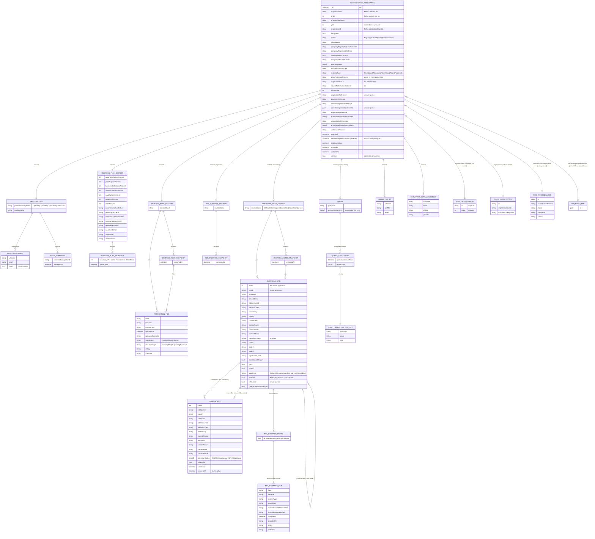

# Operator Journey (OJ) — Re-accreditation schema & ERD

Source: `epr-register-enrol-backend` @ `origin/main` (`dd71432`, 2026-10-06).
Purpose: input to designing a ReEx → OJ update API.

> **Scope note.** The OJ backend is the only repo that owns OJ persistence. `epr-register-enrol-frontend`,
> `epr-register-enrol-fe-tests` and `epr-register-enrol-mgmt-tests` hold no schema (the frontend is a
> session-only Hapi app that calls the OJ backend; the test repos only exercise it).

## 1. Key facts for API design

1. **Store:** MongoDB, .NET driver. One aggregate matters: **`accreditationApplications`**. Everything in the
   re-accreditation journey (PRNs, business plan, sampling plan, overseas sites, interim sites, BES evidence,
   query state) is **embedded** in a single document — there are no child collections.
2. **ReEx is the source of truth for organisation / registration / accreditation data, and OJ does not mirror it.**
   OJ reads ReEx at *seed* time (`POST …/{organisationId}/{registrationId}/{materialType}/seed`) and copies a
   snapshot into the application. `OrganisationModel` / `FakeOrganisationPersistence` (fake org data) and the
   `stubAccreditationApplications` collection are **local/dev fixtures only**, not on the production path.
3. **Identifier traps (RA-503):** `organisationId` = ReEx's internal ObjectId (never show to users);
   `OrgId` = ReEx's numeric org number (500500 — the user-visible one);
   `LinkedDefraOrganisation.OrgId` = a Defra UUID, a third, unrelated value despite the same name.
   `RegistrationId` and `SourceReExAccreditationId` are ReEx ObjectIds held as strings.
4. **Concurrency:** `Version` (long) optimistic token on the application, checked by `ReplaceIfMatchAsync`
   (RA-516). A ReEx-driven writer must read-modify-write with the current `Version` or use the existing endpoints.
5. **Terminal statuses** (`Approved`, `Rejected`, `Withdrawn`) reject every operator write endpoint with 409.
6. **Section edit locking:** once submitted, a section is only editable while its `SectionStatus` is `Queried`
   (`AccreditationApplicationSections.IsSectionEditable`).
7. **Snapshots:** each section has a `Versions[]` list (`[JsonIgnore]`, never on the wire) appended on Submit and each
   resubmit-after-query. These are the only history OJ keeps for section content.
8. **Server-owned fields a client cannot set:** `IsNewSite` (site + interim site), `PrnsAuthoriser.IsNew`,
   `OrsId`, `ApplicationReference`, `RegistrationReference` / `AccreditationReference` (+ `Previous*` lists),
   `NotificationStatus` / `DueDate` (live-derived, `[BsonIgnore]`).

## 2. ERD

Embedded documents are drawn as entities with `1:1` / `1:N` embedding relationships (cardinality is "contained in").
Entities prefixed `REEX_` / `CM_` / `OJ_` are external references, not stored by this aggregate.



## 2a. Document schema (`accreditationApplications`)

The ERD above as a single document. `?` = nullable/optional, `[]` = array, `"a|b"` = enum, `(srv)` = server-owned.
Per-section `versions[]` snapshot lists and `previousSites[]` exist in Mongo but are never on the wire, so they are shown once.

```jsonc
{
  "_id": "ObjectId",
  "organisationId": "string",              // ReEx ObjectId
  "orgId": "int?",                         // ReEx numeric org number
  "organisationName": "string?",
  "year": "int",
  "registrationId": "string?",             // ReEx registration ObjectId
  "isExporter": "bool",
  "nation": "England|Scotland|Wales|NorthernIreland ?",
  "siteAddress": "string?",
  "companyRegisterAddressPostcode": "string?",
  "companyRegisteredAddress": "string?",
  "isUkRegisteredAddress": "bool",
  "companiesHouseNumber": "string?",
  "permitNumbers": ["string"],
  "wasteProcessingType": "string?",
  "materialType": "Steel|Wood|Aluminium|Fibre|Glass|Paper|Plastic",
  "glassRecyclingProcess": "glass_re_melt|glass_other ?",
  "applicationStatus": "Saved|Started|Submitted|DulyMade|Queried|Updated|AwaitingDecision|Approved|Rejected|Withdrawn",
  "sourceReExAccreditationId": "string?",
  "sourceYear": "int?",
  "applicationReference": "string? (srv, unique)",
  "paymentReference": "string?",
  "caseManagementReference": "string?",
  "caseManagementWorkItemId": "guid? (unique)",
  "registrationReference": "string? (srv)",
  "previousRegistrationNumbers": ["string"],
  "accreditationReference": "string? (srv)",
  "previousAccreditationNumbers": ["string"],
  "withdrawalReason": "string?",
  "dateSent": "datetime?",
  "caseManagementStatusUpdatedAt": "datetime?",
  "dateLastEdited": "datetime",
  "createdAt": "datetime",
  "updatedAt": "datetime",
  "version": "long",                       // optimistic lock

  "submittedBy": { "fullName": "string", "jobTitle": "string", "email": "string?" },
  "submitterContactDetails": { "fullName": "string?", "email": "string?", "phone": "string?", "jobTitle": "string?" },

  "prns": {
    "plannedTonnageBand": "UpTo500|UpTo5000|UpTo10000|Over10000 ?",
    "authorisers": [ { "fullName": "string", "email": "string", "isNew": "bool (srv)" } ],
    "sectionStatus": "NotStarted|InProgress|Completed|Submitted|Queried",
    "versions": [ { "plannedTonnageBand": "...", "authorisers": ["..."], "versionedAt": "datetime" } ]
  },

  "businessPlan": {
    "newInfrastructurePercent": "int?", "priceSupportPercent": "int?", "businessCollectionsPercent": "int?",
    "communicationsPercent": "int?", "newMarketsPercent": "int?", "newUsesPercent": "int?", "otherPercent": "int?",
    "newInfrastructureDetail": "string?", "priceSupportDetail": "string?", "businessCollectionsDetail": "string?",
    "communicationsDetail": "string?", "newMarketsDetail": "string?", "newUsesDetail": "string?", "otherDetail": "string?",
    "sectionStatus": "SectionStatus",
    "versions": [ { "...same 14 fields": "", "versionedAt": "datetime" } ]
  },

  "samplingPlan": {
    "files": [
      {
        "fileId": "string", "filename": "string", "contentType": "string", "uploadedAt": "datetime",
        "uploadedByUserId": "string", "scanStatus": "Pending|Clean|Infected",
        "documentType": "SamplingPlan|SupportingEvidence ?", "s3Key": "string", "s3Bucket": "string?"
      }
    ],
    "sectionStatus": "SectionStatus",
    "versions": [ { "files": ["..."], "versionedAt": "datetime" } ]
  },

  "overseasSites": {                       // exporters only
    "sectionStatus": "SectionStatus",
    "sites": [
      {
        "siteId": "int", "orsId": "string? (srv)", "siteName": "string", "siteAddress": "string?",
        "addressLine1": "string?", "addressLine2": "string?", "townOrCity": "string?", "country": "string?",
        "coordinates": "string?", "contactName": "string?", "contactEmail": "string?", "contactPhone": "string?",
        "operationCodes": ["string"], "code1": "string?", "code2": "string?", "code3": "string?",
        "repatriatedLoads": "string?", "conditionsOfExport": "bool?", "isEu": "bool", "isOecd": "bool",
        "validFrom": "string? (ReEx ORS-A approval date)", "selected": "bool",
        "isNewSite": "bool (srv)", "registeredNowAccredited": "bool",
        "interimSites": [
          {
            "siteId": "int", "siteNumber": "string", "country": "string", "siteName": "string",
            "addressLine1": "string", "addressLine2": "string?", "townOrCity": "string",
            "stateOrRegion": "string?", "postcode": "string?",
            "contactName": "string", "contactEmail": "string", "contactPhone": "string",
            "operationCodes": ["string"],          // R12/R13 required
            "isNewSite": "bool (srv)", "createdAt": "datetime?", "removedAt": "datetime? (null = active)"
          }
        ],
        "interimSite": "InterimSite? (mirror of first active interimSites entry)",
        "besEvidence": {
          "doYouWantToUploadMoreEvidence": "bool",
          "besEvidenceUploads": [
            {
              "fileId": "string", "filename": "string", "contentType": "string?", "scanStatus": "string?",
              "besEvidenceValidFromDate": "string?", "besEvidenceExpiryDate": "string?",
              "uploadedAt": "datetime", "uploadedBy": "string?", "s3Key": "string", "s3Bucket": "string?"
            }
          ]
        },
        "previousSites": ["OverseasSite (undo stack, internal)"]
      }
    ],
    "versions": [ { "sites": ["..."], "versionedAt": "datetime" } ]
  },

  "besEvidence": {                         // exporters only
    "sectionStatus": "SectionStatus",
    "versions": [ { "versionedAt": "datetime" } ]
  },

  "query": {                               // present while/after a CM query
    "queryNote": "string?",
    "queriedSectionKeys": ["string"],
    "querySubmissions": [
      {
        "querySubmissionTime": "datetime", "sectionKeys": ["string"],
        "querySubmitterContactDetails": { "fullName": "string", "email": "string", "role": "string" }
      }
    ]
  }
}
```

Not persisted (live-derived on read): `notificationStatus`, `dueDate`.

## 2b. Sample document (reprocessor, status `Approved`)

A real stored document (mongosh notation, from a perf-test environment). It is a reprocessor, so `overseasSites`,
`besEvidence` and `query` are absent.

```js
{
  _id: ObjectId('6ac78f7eb679f1f8db8ce1a0'),
  organisationId: '60001',
  orgId: NumberInt('60001'),
  organisationName: 'PerfTest Reprocessor 001',
  year: NumberInt('2027'),
  registrationId: 'aaa000000000000000060001',
  isExporter: false,
  nation: 'England',
  siteAddress: 'Unit 1, London, SW1A 1AA',
  companyRegisterAddressPostcode: 'SW1A 1AA',
  companyRegisteredAddress: 'Unit 1, London, SW1A 1AA',
  isUkRegisteredAddress: false,
  companiesHouseNumber: 'PERF60001',
  permitNumbers: [ 'WML60001' ],
  wasteProcessingType: 'reprocessor',
  materialType: 'Plastic',
  applicationStatus: 'Approved',
  sourceReExAccreditationId: 'reex-acc-60001-Plastic-2026',
  sourceYear: NumberInt('2026'),
  applicationReference: 'AP27EA0600011AAPL',
  paymentReference: 'PR/PK/REP/60001',
  caseManagementWorkItemId: UUID('159d7178-df35-4cd7-993f-47c8b4419b71'),
  registrationReference: 'PERF-60001',
  previousRegistrationNumbers: [],
  accreditationReference: 'A27ER0600010321PL',
  previousAccreditationNumbers: [],
  submittedBy: {
    fullName: 'Claude-Louis Navier',
    jobTitle: 'Engineer and Physicist',
    email: 'test@defra.gov.uk'
  },
  submitterContactDetails: {
    fullName: 'Stub Submitter',
    email: 'stub.submitter@example.com',
    phone: '01234 567890',
    jobTitle: 'Stub Job Title'
  },
  dateSent: ISODate('2026-10-08T12:42:37.668Z'),
  caseManagementStatusUpdatedAt: ISODate('2026-10-08T12:45:19.942Z'),
  dateLastEdited: ISODate('2026-10-08T12:45:19.994Z'),
  createdAt: ISODate('2026-10-08T12:41:34.687Z'),
  updatedAt: ISODate('2026-10-08T12:45:19.994Z'),
  version: NumberLong('14'),
  prns: {
    plannedTonnageBand: NumberInt('0'),
    authorisers: [
      { fullName: 'Stub Authoriser', email: 'stub@example.com', isNew: false }
    ],
    sectionStatus: NumberInt('2'),
    versions: [
      {
        plannedTonnageBand: NumberInt('0'),
        authorisers: [
          { fullName: 'Stub Authoriser', email: 'stub@example.com', isNew: false }
        ],
        versionedAt: ISODate('2026-10-08T12:42:37.668Z')
      }
    ]
  },
  businessPlan: {
    newInfrastructurePercent: NumberInt('100'),
    priceSupportPercent: NumberInt('0'),
    businessCollectionsPercent: NumberInt('0'),
    communicationsPercent: NumberInt('0'),
    newMarketsPercent: NumberInt('0'),
    newUsesPercent: NumberInt('0'),
    otherPercent: NumberInt('0'),
    newInfrastructureDetail: 'wer',
    priceSupportDetail: '',
    businessCollectionsDetail: '',
    communicationsDetail: '',
    newMarketsDetail: '',
    newUsesDetail: '',
    otherDetail: '',
    sectionStatus: NumberInt('2'),
    versions: [
      {
        newInfrastructurePercent: NumberInt('100'),
        priceSupportPercent: NumberInt('0'),
        businessCollectionsPercent: NumberInt('0'),
        communicationsPercent: NumberInt('0'),
        newMarketsPercent: NumberInt('0'),
        newUsesPercent: NumberInt('0'),
        otherPercent: NumberInt('0'),
        newInfrastructureDetail: 'wer',
        priceSupportDetail: '',
        businessCollectionsDetail: '',
        communicationsDetail: '',
        newMarketsDetail: '',
        newUsesDetail: '',
        otherDetail: '',
        versionedAt: ISODate('2026-10-08T12:42:37.668Z')
      }
    ]
  },
  samplingPlan: {
    files: [
      {
        fileId: '11db78b7-e996-4959-99e2-9354383c53ee',
        filename: 'image.png',
        contentType: 'image/png',
        uploadedAt: ISODate('2026-10-08T12:42:22.532Z'),
        uploadedByUserId: '',
        scanStatus: NumberInt('1'),
        documentType: NumberInt('0'),
        s3Key: 'sampling-plans/accreditation/sampling-plan/6ac78f7eb679f1f8db8ce1a0/b31544c4-07e5-4cf2-92ad-5be3acb1ceec/11db78b7-e996-4959-99e2-9354383c53ee',
        s3Bucket: 'epr-register-enrol-file-uploads'
      }
    ],
    sectionStatus: NumberInt('2'),
    versions: [
      {
        files: [ /* same file entry as above */ ],
        versionedAt: ISODate('2026-10-08T12:42:37.668Z')
      }
    ]
  }
}
```

**Enum storage (important for a direct-write API).** Enums are *not* stored uniformly:

| Stored as | Fields | Sample value |
| --- | --- | --- |
| **String** | `nation`, `materialType`, `glassRecyclingProcess`, `applicationStatus` | `'England'`, `'Plastic'`, `'Approved'` |
| **Int (ordinal)** | `plannedTonnageBand`, every `sectionStatus`, file `scanStatus`, file `documentType` | `0`, `2`, `1`, `0` |

Ordinals: `plannedTonnageBand` 0 = UpTo500, 1 = UpTo5000, 2 = UpTo10000, 3 = Over10000 ·
`sectionStatus` 0 = NotStarted, 1 = InProgress, 2 = Completed, 3 = Submitted, 4 = Queried ·
`scanStatus` 0 = Pending, 1 = Clean, 2 = Infected · `documentType` 0 = SamplingPlan, 1 = SupportingEvidence.
The API (JSON) exposes these as names; only Mongo holds the ints. Section 2a shows the names.

## 3. Collections & indexes

| Collection | Purpose | Key / indexes |
| --- | --- | --- |
| `accreditationApplications` | **The re-accreditation aggregate** (everything in §2) | `_id` ObjectId; `organisationId`; `applicationStatus`; `materialType`; `year`; `sourceReExAccreditationId`; compound `(organisationId, materialType, year)`; compound `(organisationId, createdAt↓, _id↓)`; **unique sparse** `applicationReference`; **unique sparse** `caseManagementWorkItemId` |

There is **no natural-key uniqueness** on `(organisationId, registrationId, materialType, year)`; seed idempotency is
enforced in application code (a prior defect, fix 2026-07-24-1: a missing `registrationId` made the idempotency check miss
and created an orphan document). A ReEx-driven create/update must supply `registrationId` and look up before insert.

## 4. Enumerations

- **`ApplicationStatus`**: `Saved`, `Started`, `Submitted`, `DulyMade`, `Queried`, `Updated`, `AwaitingDecision`,
  `Approved`, `Rejected`, `Withdrawn`. (Terminal: Approved/Rejected/Withdrawn.) Driven partly by CM pushes
  (`case-management/{workItemId}/status`), guarded by `caseManagementStatusUpdatedAt`.
- **`SectionStatus`**: `NotStarted`, `InProgress`, `Completed`, `Submitted`, `Queried`.
- **`MaterialType`**: Steel, Wood, Aluminium, Fibre, Glass, Paper, Plastic. **`GlassRecyclingProcess`**: `glass_re_melt`, `glass_other`.
- **`Nation`**: England, Scotland, Wales, NorthernIreland — derived at seed from the *registration's* `submittedToRegulator`
  (never the org's, never postcode — RA-526).
- **`PlannedTonnageBand`**: UpTo500, UpTo5000, UpTo10000, Over10000.
- **`FileScanStatus`**: Pending, Clean, Infected. **`AccreditationFileDocumentType`**: SamplingPlan, SupportingEvidence.
- **CM section keys** (closed vocabulary used on query push) → OJ section: `authority-to-issue` & `prn-tonnage` → Prns;
  `business-plan` → BusinessPlan; `sampling-and-inspection-plan` → SamplingPlan;
  `broadly-equivalent-standards` → BesEvidence; `overseas-reprocessing-sites` → OverseasSites (last two exporter-only).

## 5. Upstream shape the OJ seeds from (ReEx — not stored, for mapping reference)

`OrganisationDto` (`ReEx/Dtos/OrganisationDto.cs`): `id`, `orgId`, `companyDetails`, `submitterContactDetails`,
`managementContactDetails`, `submittedToRegulator` (org-level; **do not use for nation**), `linkedDefraOrganisation.orgId`,
`registrations[]` (polymorphic on `wasteProcessingType`: `reprocessor` | `exporter`), `accreditations[]`.
Registration → `registrationNumber`, `accreditationId`, `submittedToRegulator`, `wasteManagementPermits[]`,
`glassRecyclingProcess[]`, exporter: `exportPorts[]`, `orsFileUploads[]`, `overseasSites{key→ref}`;
reprocessor: `site`, `yearlyMetrics[]`, `plantEquipmentDetails`, `reprocessingType`.
Accreditation → `accreditationNumber`, `status`, `material`, `validFrom/To`, `prnIssuance{tonnageBand, signatories[], incomeBusinessPlan[]}`.

Seed mapping (`ReExAccreditationDto` → `AccreditationApplicationModel`): `prnIssuance.tonnageBand`→`Prns.PlannedTonnageBand`;
`signatories`→`Prns.Authorisers`; `incomeBusinessPlan`→`BusinessPlan.*Percent`; ORS list→`OverseasSites.Sites`
(`validFrom != null` ⇒ `Selected=true`); registration `submittedToRegulator`→`Nation`.

## 6. Existing inbound endpoints (base `api/v1/accreditation-applications`)

| Caller / auth scheme | Route | Effect |
| --- | --- | --- |
| Frontend (`FrontendOnly`) | `POST {orgId}/{regId}/{material}/seed` | Create application from ReEx snapshot |
| Frontend | `GET {orgId}`, `GET {orgId}/{appId}` | List / get (GetById live-derives `notificationStatus`, `dueDate` from CM) |
| Frontend | `PATCH …/prns`, `…/tonnage`, `…/business-plan`, `…/sampling-plan`, `…/overseas-sites`, `…/bes-evidence` | Section writes |
| Frontend | `POST …/overseas-sites`; `PATCH/…/overseas-sites/{siteId}` (+ `/promote`, `/revert`, `/bes-evidence/**`) | ORS CRUD |
| Frontend | `POST/PATCH/DELETE …/overseas-sites/{siteId}/interim-sites[/{id}][/restore]` | Interim-site CRUD (soft delete via `removedAt`) |
| Frontend | `POST …/files`, `…/files/initiate`, `DELETE …/files/{fileId}`, `GET …/files/{id}/status` | Uploads |
| Frontend | `POST …/submit`, `…/resubmit`, `…/withdraw` | Journey transitions (call CM) |
| CDP uploader | `POST files/upload-completed` | Scan webhook |
| **CaseManagement** (`CaseManagementAuthenticationHandler`) | `POST case-management/{workItemId}/query` | CM raised a query → sets `Query`, section statuses `Queried` |
| **CaseManagement** | `POST case-management/{workItemId}/status` | CM state change → `ApplicationStatus` |
| **CaseManagement** | `POST {orgId}/{appId}/registration-number`, `…/accreditation-number` | Generate/regenerate numbers (`{nation, orgId, year, regenerate}`) |
| **CaseManagement** | `PATCH {orgId}/{appId}/overseas-sites/{siteId}/recycling-operations` | Correct `operationCodes` (audited) |
| Frontend | `GET api/v1/organisations/{organisationId}/defra-link` | Resolve linked Defra org |

> **Gap for ReEx→OJ:** there is currently **no ReEx-authenticated route** — the only service-to-service scheme besides
> the frontend is `CaseManagement`. ReEx would need its own auth scheme/policy.

## 7. Caveats

- Documents in `main` may not have been migrated: fields added later (`Nation`, `OrgId`, `PaymentReference`,
  `InterimSites`, `CreatedAt`/`RemovedAt`, `IsNewSite`, `SubmitterContactDetails`) are nullable/defaulted on legacy
  documents. `InterimSite` (singular) is a derived mirror of the first active `InterimSites[]` entry (RA-603).
- `RegisteredNowAccredited` and `PreviousSites` are internal (the latter `[JsonIgnore]`).
- Cardinality in the ERD means *embedding* (document containment), not foreign keys; only the `REEX_*` / `CM_WORK_ITEM` reference relationships cross a document boundary, and none is enforced by Mongo.
